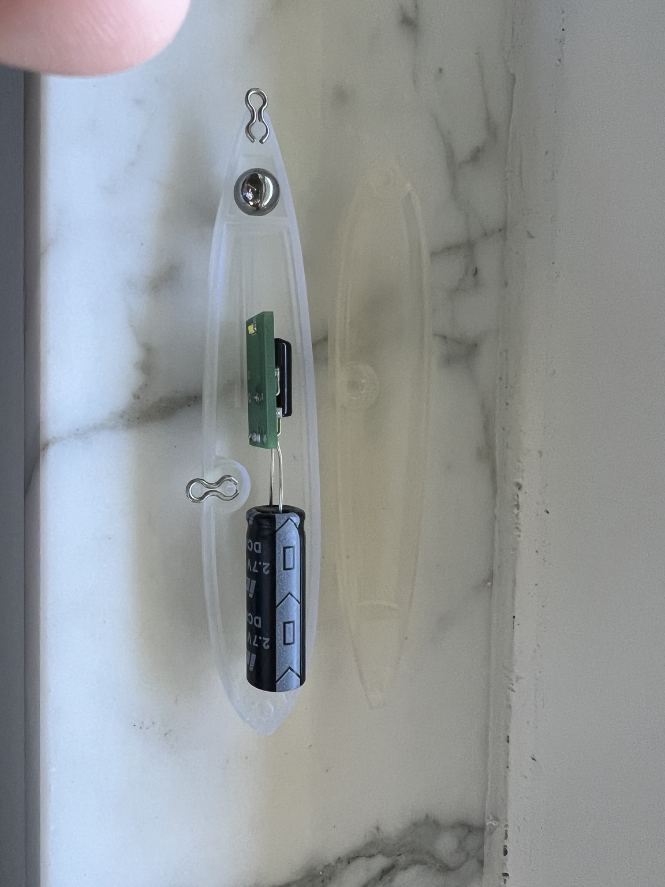
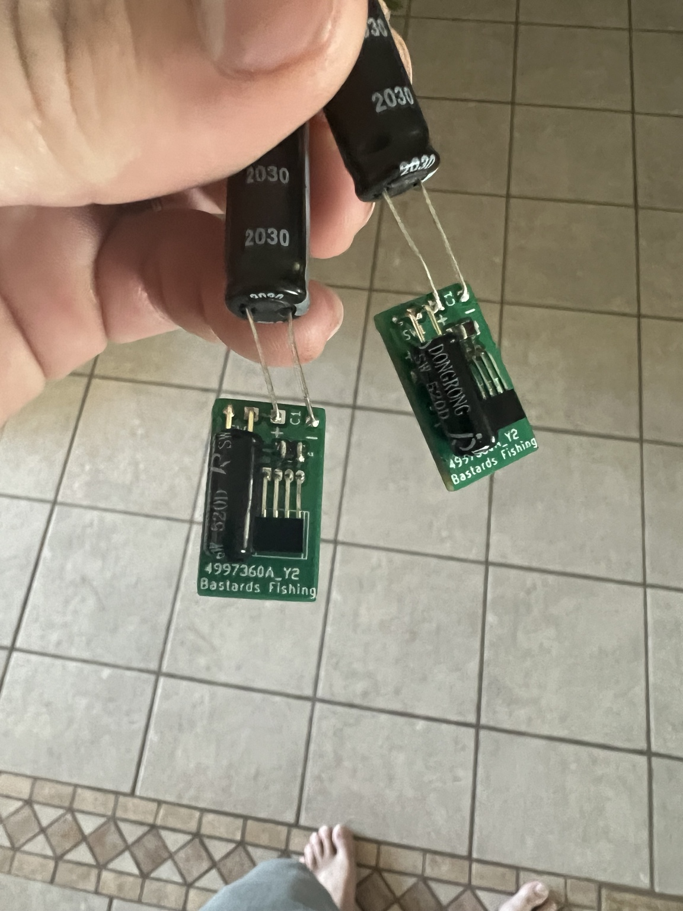
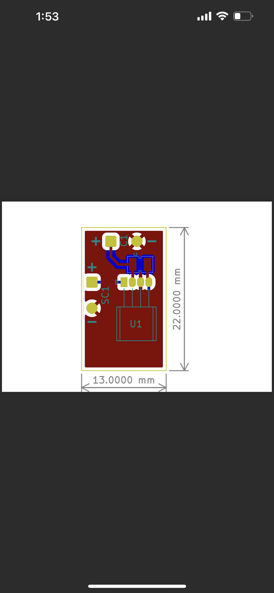

# Motion-Activated Fishing Lure Electronics

## Overview
Designed and developed compact embedded electronics for a motion-activated flashing fishing lure system integrating miniaturized PCB design, power management, waterproof packaging, and compact product assembly.

## Contributions
- Developed miniature PCB layouts for compact embedded electronics integration
- Integrated motion-activated functionality and flashing LED control concepts
- Designed waterproof lure packaging and compact internal assembly architecture
- Iterated enclosure geometry and electronic packaging for durability and manufacturability
- Worked through size constraints, battery integration, and environmental considerations
- Produced functional prototype assemblies and iterative hardware revisions

## Technologies & Tools
- PCB layout
- Embedded electronics
- Miniaturized product packaging
- CAD modeling
- Additive manufacturing
- Prototype assembly
- Rapid iteration

## Project Images

### Prototype Assembly

### PCB Revision

### PCB Render

### PCB Layout

