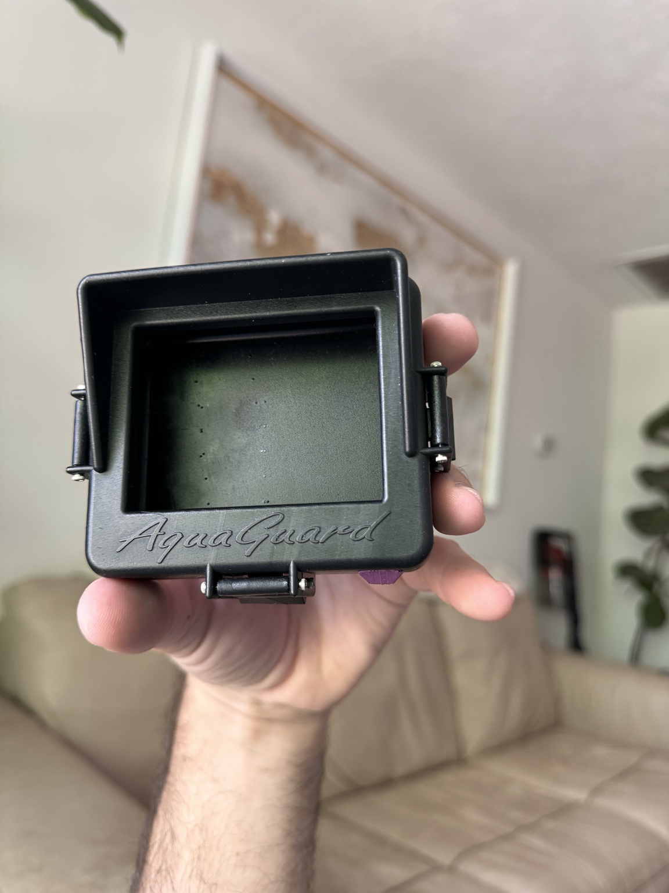
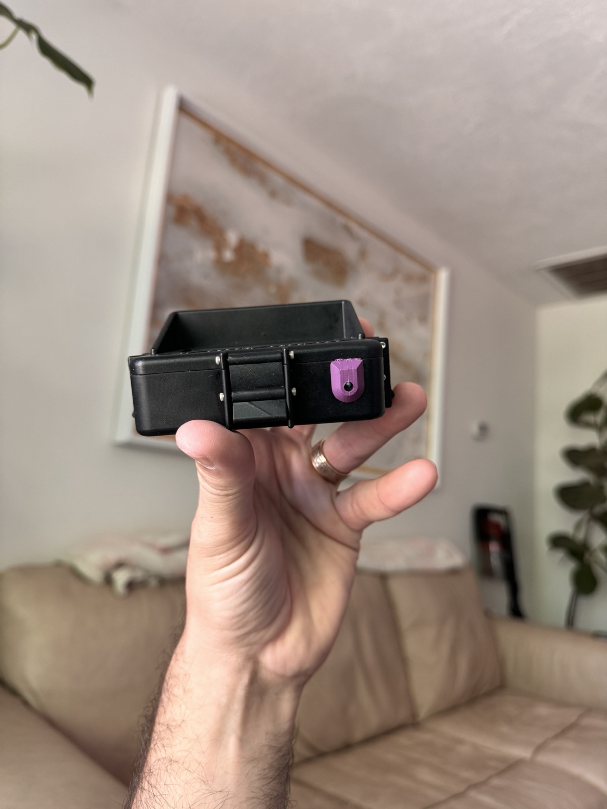
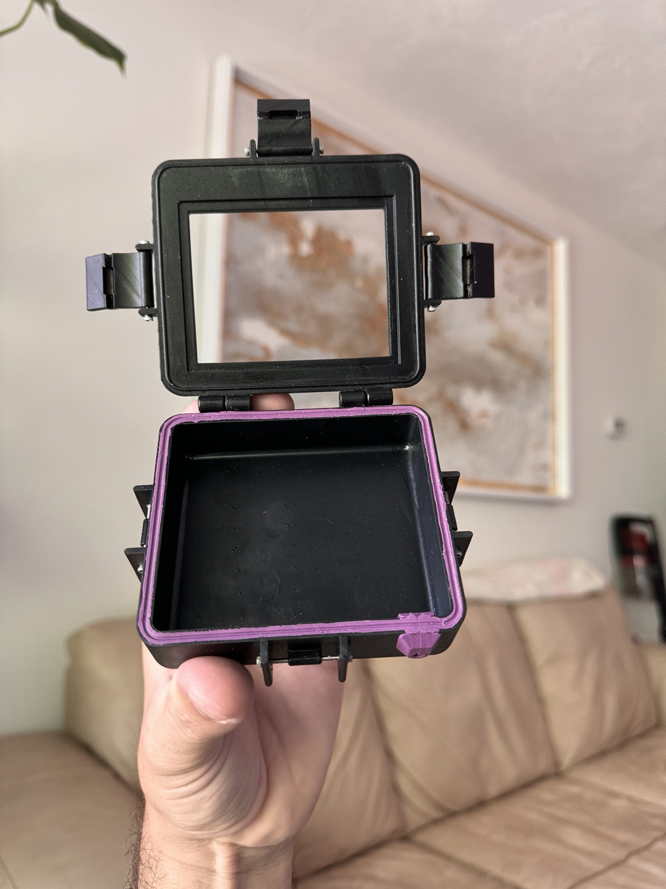

# Waterproof Holley ECU Enclosure

## Overview
Designed and developed a custom waterproof enclosure system for a Holley engine controller focused on environmental protection, mounting integration, and real-world automotive use.

## Contributions
- Designed custom enclosure modifications and integrated mounting hardware
- Developed sealing concepts and waterproofing features for electronics protection
- Integrated cable routing and controller packaging considerations
- Iterated printed components for fitment, durability, and ease of installation
- Balanced packaging constraints with accessibility and environmental resistance requirements

## Technologies & Tools
- Fusion 360
- Functional additive manufacturing
- Electronics packaging
- Automotive systems integration
- Mechanical prototyping
- Product iteration

## Engineering Focus
Focused on environmental sealing, electronics packaging, automotive integration, and iterative prototype development for real-world operating conditions.

## Project Images

### Enclosure Assembly

### Internal Packaging

### Open Enclosure

